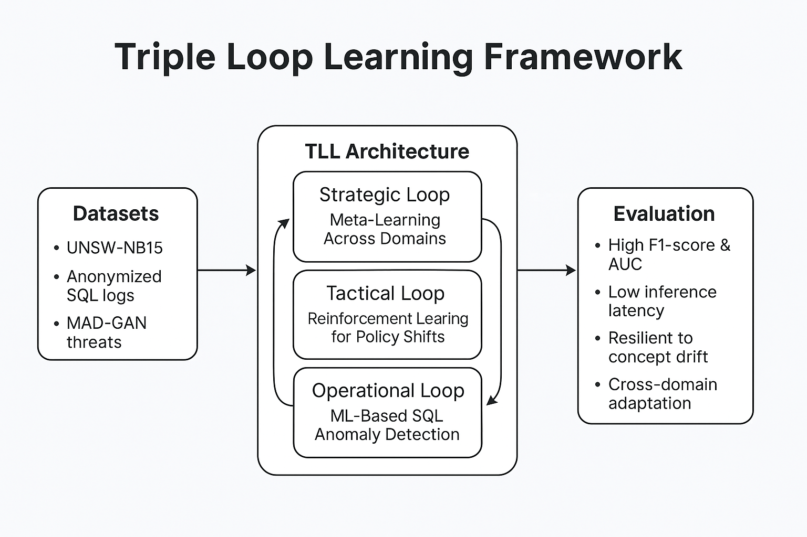

# Triple Loop Learning for RDBMS Anomaly Detection

This repository contains the official implementation of the paper:

**"Intelligent Anomaly Detection in Database Security: A Triple-Loop Learning Framework"**  
📝 William Kandolo – University of Vienna  
📎 IEEE Conference, 2025  
📄 DOI: _Coming Soon_

## 🔍 Overview

Triple Loop Learning (TLL) is a recursive architecture for SQL-based anomaly detection that integrates:

- SQL-aware Autoencoders (Operational Loop)
- Deep Q-Learning for threshold calibration (Tactical Loop)
- Model-Agnostic Meta-Learning (MAML) for domain generalization (Strategic Loop)

TLL achieves state-of-the-art detection of SQL injections, insider misuse, and mimicry attacks with high accuracy and low latency.

---

## 📁 Repository Structure

